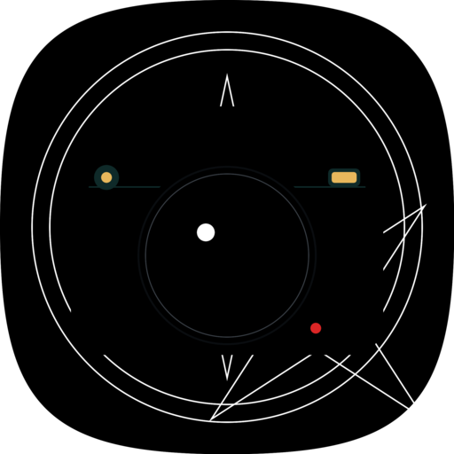
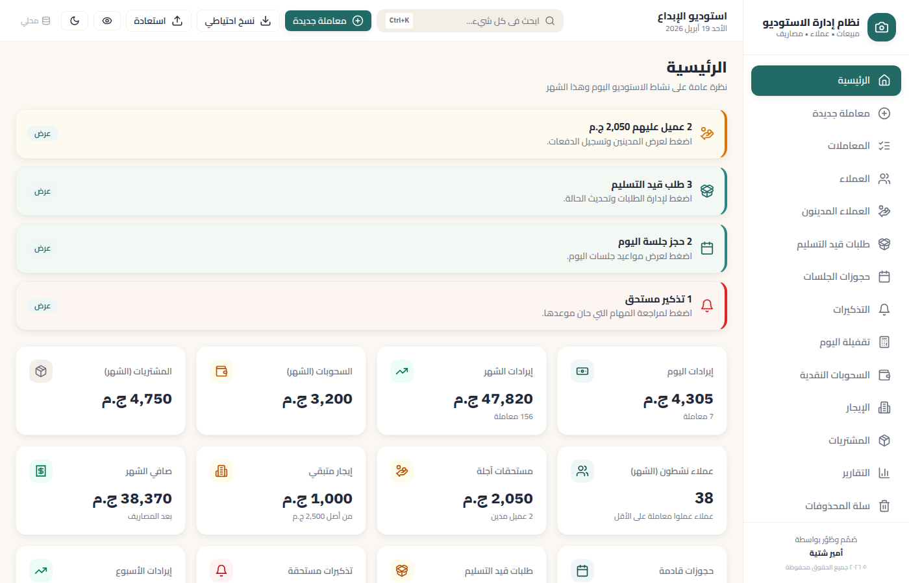
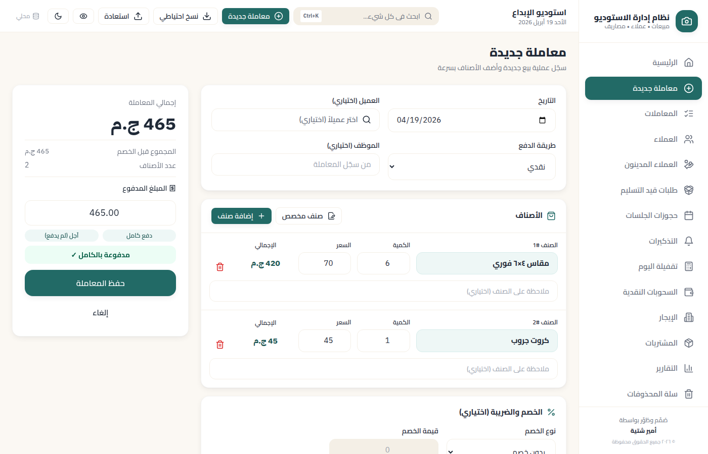
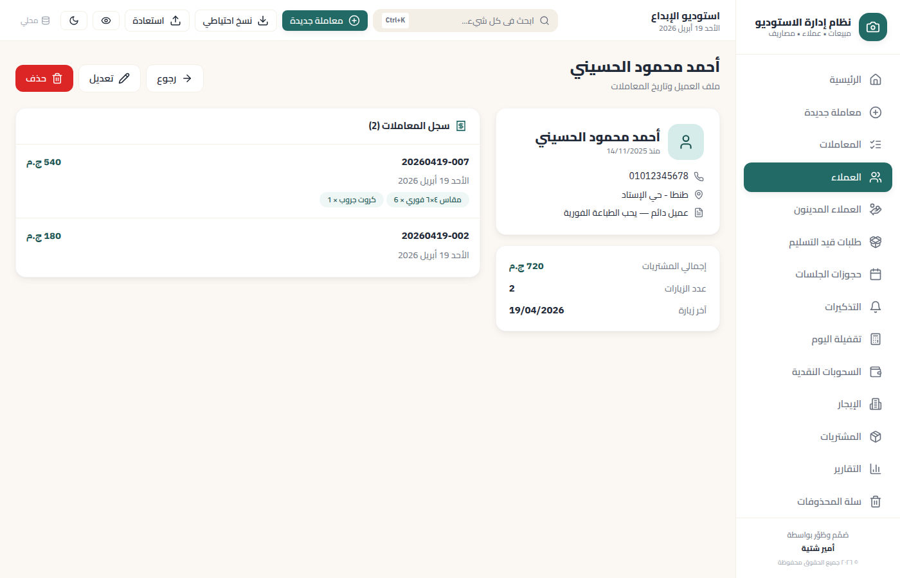
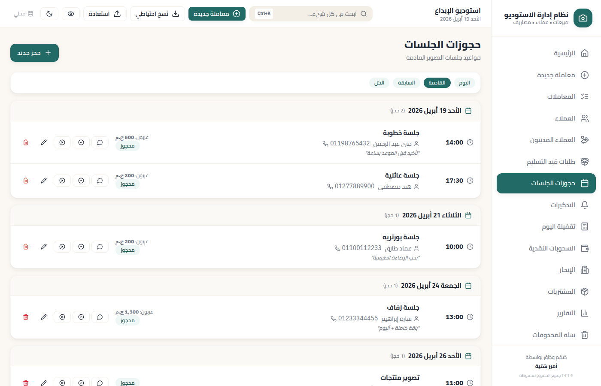
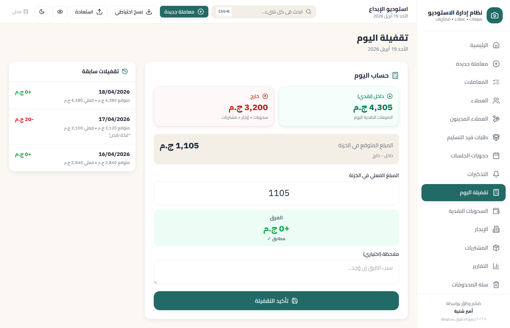
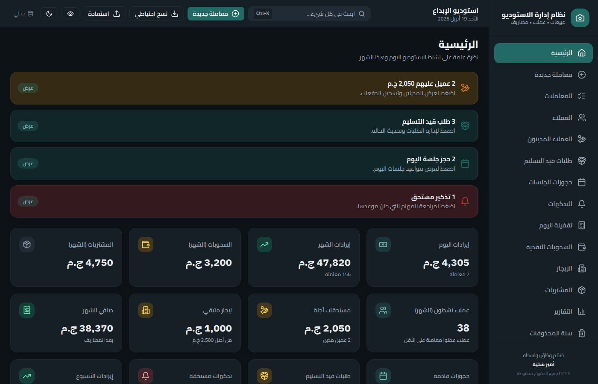

<div align="center">



# نظام إدارة مبيعات الاستوديو
### Photography Studio Management System

A complete, fully Arabic, offline‑first desktop app for running a photography studio.
Track sales, customers, debts, bookings, expenses, and more — all stored locally on the owner's PC.

[](https://github.com/NightBaRron1412/studio_managment/releases/latest)
[](https://github.com/NightBaRron1412/studio_managment/actions)
[](https://github.com/NightBaRron1412/studio_managment/releases)
[](LICENSE)

[](#installation)
[](#)
[](#)
[](#)
[](#)
[](#)
[](#)
[](#auto-updates)

[**📥 Download for Windows**](https://github.com/NightBaRron1412/studio_managment/releases/latest) ·
[**🐛 Report a bug**](https://github.com/NightBaRron1412/studio_managment/issues/new) ·
[**📖 Arabic install guide**](INSTALL_AR.md)

</div>

---

## ✨ Why this app

Most studio owners in the MENA region either:
- Track everything in a paper notebook (loses data, no reports), OR
- Use a generic POS system (English-first, missing photography-specific workflows like آجل / pickups / bookings).

This app is **purpose-built for photography studios**, **fully Arabic with proper RTL**, and **runs entirely on the studio's PC** — no cloud, no monthly fee, no internet required.

---

## 📸 Screenshots

> Drop screenshots into `docs/screenshots/` and they'll appear here. Recommended: 1400×900 PNGs.

<table>
  <tr>
    <td align="center">
      
      <br/><strong>الرئيسية — Dashboard</strong>
      <br/><sub>Daily/monthly income, debts, pickups, bookings, weekly trend</sub>
    </td>
    <td align="center">
      
      <br/><strong>معاملة جديدة — New Transaction</strong>
      <br/><sub>Multi-line items, custom items, discount, VAT, partial pay</sub>
    </td>
  </tr>
  <tr>
    <td align="center">
      
      <br/><strong>ملف العميل — Client Profile</strong>
      <br/><sub>Full purchase history, total spent, visits, debts</sub>
    </td>
    <td align="center">
      
      <br/><strong>حجوزات الجلسات — Bookings</strong>
      <br/><sub>Sessions calendar with deposits and WhatsApp reminders</sub>
    </td>
  </tr>
  <tr>
    <td align="center">
      
      <br/><strong>تقفيلة اليوم — End of Day</strong>
      <br/><sub>Expected cash vs actual count + history</sub>
    </td>
    <td align="center">
      
      <br/><strong>الوضع الداكن — Dark Mode</strong>
      <br/><sub>Easy on the eyes for late-night work</sub>
    </td>
  </tr>
</table>

---

## 🎯 Features

### 💰 Sales & Customers
- **معاملات** — multi-line transactions with predefined or custom items
- **العملاء** — full directory with purchase history, total spent, last visit, smart suggestions per client
- **آجل / دَين** — partial payments, dedicated debtors page, mark-as-paid actions, dashboard alerts
- **خصم وضريبة** — line discount (% or fixed) + optional VAT toggle
- **طرق دفع متعددة** — cash, card, transfer, e-wallet, credit
- **تكرار المعاملة** — duplicate any past transaction in one click

### 📅 Schedule & Operations
- **حجوزات الجلسات** — sessions calendar with type, deposit, status; today/upcoming/past filters
- **طلبات قيد التسليم** — pickup status (pending/ready/delivered) with overdue alerts
- **تذكيرات** — to-do list with due dates and dashboard alerts
- **تقفيلة اليوم** — end-of-day cash close with expected vs actual + difference history

### 💸 Money Out
- **سحوبات نقدية** — cash withdrawals with date, amount, person, reason
- **إيجار شهري** — month-by-month rent with partial payments and progress bar
- **مشتريات ومخزون** — supplies tracking with quantity, cost, supplier

### 📊 Reports & Insights
- **تقارير ذكية** — date range, by item, by category, by payment method
- **تصدير PDF و Excel** — for accountant or backup
- **رسوم بيانية** — daily income line chart
- **مؤشرات الأداء** — net month, weekly trend (% vs last week), active clients count, top 5 items

### 🛡️ Safety & Reliability
- **نسخ احتياطي يدوي وتلقائي** — to any folder; keeps last 7 auto‑backups
- **استعادة بضغطة زر** — from any backup `.db` file
- **سلة المحذوفات** — soft delete; restore or purge with type-to-confirm
- **إعادة ضبط النظام** — wipe records or full factory reset (confirmation gated)
- **رقم سري** — optional 4–8 digit PIN to lock the app

### 🎨 Polish & UX
- **عربي 100%** — Cairo font, RTL throughout, Arabic-Indic numerals option
- **🌙 وضع داكن** — Ctrl/⌘+H toggle
- **👁️ وضع الخصوصية** — blur all amounts when customer is looking
- **⌨️ بحث ذكي Ctrl+K** — spotlight overlay across pages, clients, transactions
- **شعار المحل على الفواتير** — owner uploads PNG, appears on every printed receipt
- **مشاركة عبر واتساب** — pre-filled message + reveals PDF for drag-attach

### 🚀 Distribution
- **مثبِّت Windows واحد** — `.exe` NSIS installer with desktop shortcut + Start Menu entry
- **تحديثات تلقائية** — built-in check, download (with progress bar), one-click install
- **معالج الإعداد الأول** — 4-step wizard on first launch

---

## 📥 Installation

### For end users (studio owners)

Each release ships **two downloads** — pick the one that fits:

| Download | When to use | Auto-update? | Browser warning? |
|---|---|---|---|
| `*-Setup-x.x.x.exe` (NSIS installer) | **Recommended.** Normal install with Start Menu + Desktop shortcuts. | ✅ Yes (in-app) | Sometimes — see below |
| `*-x.x.x-win.zip` (portable) | If the `.exe` is blocked by Chrome/Edge ("virus detected") or you want a no-install version on a USB stick. | ❌ No (manual download per release) | None |

#### Installer (.exe) — the normal path

1. Go to the [latest release](https://github.com/NightBaRron1412/studio_managment/releases/latest).
2. Download `...-Setup-x.x.x.exe`.
3. If the browser blocks it as "virus detected", switch to the **portable .zip** below — the installer is signed but new releases need time to build SmartScreen reputation.
4. Double-click. Windows may show "Windows protected your PC" → **More info** → **Run anyway**.
5. Creates a desktop shortcut + Start Menu entry.
6. On first launch, the **onboarding wizard** asks for business name, owner, phone, currency, and default rent — done!

#### Portable (.zip) — fallback / USB version

1. Download `...-win.zip` from the same release page.
2. Extract anywhere (Desktop, USB drive, `C:\StudioManager\`, etc.).
3. Double-click `StudioManager.exe` inside the extracted folder.
4. **Note:** portable users must **manually download new versions** from GitHub. The in-app updater only works for the installed (.exe) version.

📖 **Arabic step-by-step:** [INSTALL_AR.md](INSTALL_AR.md)

### Updates

Installed via the `.exe`? The app **checks for updates from inside Settings → فحص التحديثات** with a one-click download + install. No need to redownload from GitHub.

Using the portable `.zip`? Re-download the latest zip and replace the folder.

---

## 🛠️ Tech stack

| Layer | Choice | Why |
|---|---|---|
| Shell | **Electron 32** | Most reliable Windows packaging, NSIS installer, single icon |
| UI | **React 18 + TypeScript + Vite** | Type-safe, fast HMR, modern |
| Styling | **Tailwind CSS** with logical RTL properties | First-class RTL, dark mode via CSS vars |
| Components | Hand-rolled with Lucide icons | No third-party UI library bloat |
| State / data | **TanStack Query + Zustand** | Smart caching for SQLite reads + tiny global state |
| Database | **better-sqlite3** | Synchronous, embedded, single-file `.db` = trivial backup |
| Routing | **React Router 6** (HashRouter for `file://`) | Client-side routing in Electron |
| PDF | **@react-pdf/renderer** | Receipts + reports |
| Excel | **exceljs** | Reports + client list export |
| Charts | **Recharts** | Dashboard + reports |
| Build | **electron-vite** + **electron-builder** | Bundles main/preload/renderer + NSIS installer |
| Auto‑update | **electron-updater** with GitHub feed | Checks → downloads → installs without user juggling |

---

## 🧱 Project structure

```
src/
├── main/                        # Electron main process (Node.js)
│   ├── index.ts                 # Window creation + lifecycle
│   ├── splash.ts                # Launch splash screen
│   ├── db.ts                    # SQLite init + migrations + seed
│   ├── ipc.ts                   # All IPC handlers (~50 channels)
│   ├── pdf.ts                   # PDF generation (receipts + reports)
│   ├── excel.ts                 # Excel export
│   ├── autoBackup.ts            # Daily backup + retention
│   └── repos/                   # One file per entity
│       ├── clients.ts
│       ├── transactions.ts      # incl. pickup, debtors, mark-paid
│       ├── bookings.ts
│       ├── reminders.ts
│       ├── cashClose.ts
│       ├── recycle.ts           # Soft-delete restore/purge
│       └── system.ts            # Reset-data + factory-reset
├── preload/                     # Secure contextBridge IPC
├── shared/types.ts              # Types shared between main & renderer
└── renderer/                    # React app (Vite-bundled)
    └── src/
        ├── App.tsx              # Routes
        ├── components/          # Layout, Sidebar, TopBar, Spotlight, PinLock, Onboarding, ...
        ├── pages/               # Dashboard, NewTransaction, Clients, Bookings, ...
        ├── lib/                 # api wrapper, date/money formatters, cn helper
        └── store/               # Toast store
.github/workflows/
└── build-windows.yml            # Windows installer build + auto-publish to Releases
resources/
├── icon.svg                     # Source icon
├── icon.ico                     # Windows installer + .exe icon
└── icon.png                     # Linux/AppImage icon
```

**Database schema:** ~12 tables — clients, items, categories, transactions, transaction_items, withdrawals, rent_payments, inventory_purchases, cash_closes, bookings, reminders, settings — all defined in `src/main/db.ts` with idempotent migrations + soft-delete columns.

---

## 💻 Development setup

### Prerequisites
- **Node.js 20+** ([nvm install 20](https://github.com/nvm-sh/nvm))
- For Windows builds: **build on Windows** (best path) or use the included GitHub Actions workflow

### Clone & install
```bash
git clone git@github.com:NightBaRron1412/studio_managment.git
cd studio_managment
npm install
```

`postinstall` rebuilds `better-sqlite3` for Electron's Node ABI. If you ever see "wrong NODE_MODULE_VERSION", run `npm run rebuild`.

### Run in dev mode
```bash
npm run dev
```
Hot-reloads the React renderer; the main process restarts automatically on file changes.

### Type-check
```bash
npm run typecheck
```

### Build artifacts
```bash
npm run build              # builds out/main, out/preload, out/renderer
npm run build:win          # also packages a Windows NSIS installer
npm run build:linux        # also packages a Linux AppImage
```

Output goes to `dist-installer/`.

### Test the AppImage on Linux
```bash
./dist-installer/نظام\ إدارة\ مبيعات\ الاستوديو-1.0.5.AppImage --no-sandbox
```

---

## 🚀 Releasing a new version

The repository ships with a [GitHub Actions workflow](.github/workflows/build-windows.yml) that:
- **On push to `main`** → builds the Windows `.exe` as a downloadable artifact (90 days retention)
- **On a `v*` tag push** → builds AND publishes a GitHub Release with `latest.yml` for auto-update

To cut a new release:
```bash
# 1. Bump the version in package.json (e.g. 1.0.5 → 1.0.6)
# 2. Commit, tag, push
git add package.json && git commit -m "v1.0.6"
git tag v1.0.6 && git push origin main v1.0.6
```

~6 minutes later → users see **تتوفر نسخة جديدة: 1.0.6** in Settings → فحص التحديثات.

---

## 🔄 Auto‑updates

Configured in `package.json` under `build.publish`:
```json
{
  "provider": "github",
  "owner": "NightBaRron1412",
  "repo": "studio_managment",
  "releaseType": "release"
}
```

`electron-updater` polls the latest release from GitHub. The renderer flow:

1. **فحص التحديثات** → calls `update:check` → returns `{ available, version }`
2. If available → user clicks **تحميل التحديث** → calls `update:download` with **live progress bar** (driven by `download-progress` events)
3. When 100% → user clicks **إعادة التشغيل والتثبيت** → calls `update:install` → `quitAndInstall()` runs the NSIS updater

Works completely offline-tolerant — failures are caught at every step and shown in a friendly Arabic error box.

---

## 💾 Where data lives

The single-file SQLite database lives in the per-user app data folder:

| OS | Path |
|---|---|
| **Windows** | `C:\Users\<username>\AppData\Roaming\studio-manager\studio.db` |
| **macOS** | `~/Library/Application Support/studio-manager/studio.db` |
| **Linux** | `~/.config/studio-manager/studio.db` |

Backups are just copies of this file. Restoring = replacing it. No vendor lock-in.

---

## 🧭 Roadmap

The product is intentionally **feature-complete for v1**. Future work depends on real user feedback. Likely candidates from talking to studio owners:

- [ ] What's-new dialog after auto-update
- [ ] Thermal receipt printer support (58/80mm)
- [ ] Multi-currency display per transaction (for tourist studios)
- [ ] Bundled Arabic font (Noto Naskh Arabic) for crisper PDF receipts
- [ ] Loyalty/discount automation
- [ ] Per-staff commissions

PRs welcome.

---

## 👤 Developer

**Amir Shetaia** (أمير شتية)
- 📧 [ashetaia01@gmail.com](mailto:ashetaia01@gmail.com)
- 📱 +20 1015136243

---

## 📜 License

MIT — see [LICENSE](LICENSE).

Free to use, modify, and distribute. If you build something cool with it, drop a line.

---

<div align="center">

**Built with ❤️ for studio owners who deserve software that speaks their language.**

</div>
